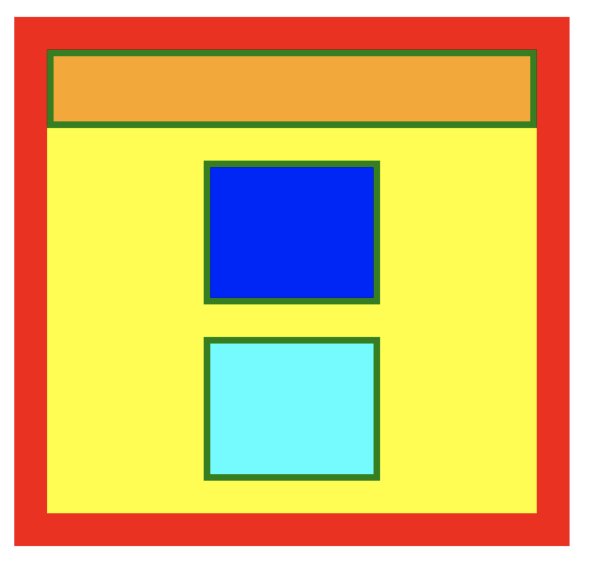

# Rhino

一个简单的浏览器引擎（DEMO）。

1. 解析 css 和 html 代码，生成 dom 和 stylesheet
2. 把 dom 和 stylesheet 组装成 style tree
3. 根据 style tree 生成 layout tree
4. 计算布局
5. 使用 Native 组件渲染


## DEMO

```swift

class ViewController: UIViewController {

    // html code
    let html = #"""
    """#

    /// css styles
    let css = #"""
    """#
        
    override func viewDidLoad() {
        super.viewDidLoad()

        /// render
        Renderer.render(html: html, css: css, in: view)
    }

}

```


渲染结果：


